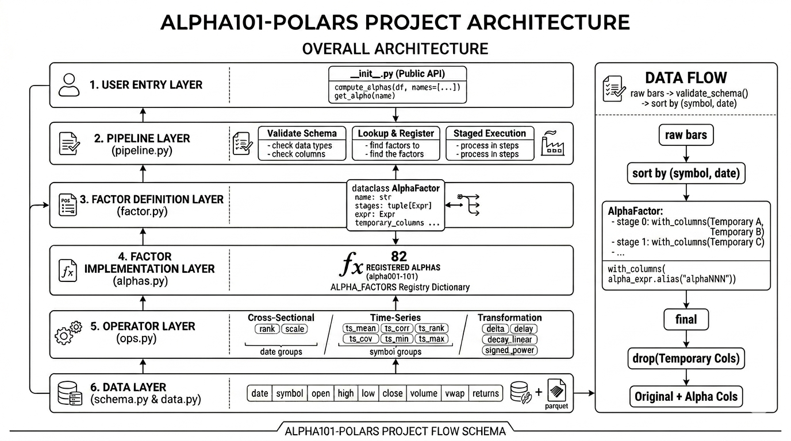

# Alpha101-polars

English | [中文](README_CN.md)



Polars-native implementations of representative WorldQuant Alpha101 factors.

The project is designed around staged `polars.Expr` pipelines. Cross-sectional
operators such as `rank(x)` are evaluated per `date`, while time-series
operators such as `correlation(x, y, d)` are evaluated per `symbol`.

## Status

This repository currently contains the project skeleton, common Alpha101
operators, AkShare data utilities, and supported factors through Alpha#101:

```text
alpha001-alpha101, excluding:
alpha048, alpha056, alpha058, alpha059, alpha063, alpha067, alpha069,
alpha070, alpha076, alpha079, alpha080, alpha082, alpha087, alpha089,
alpha090, alpha091, alpha093, alpha097, alpha100
```

More formulas can be added incrementally on top of the shared operators.

## Data Schema

The default schema is:

```text
date, symbol, open, high, low, close, volume, vwap, returns
```

Time-series operations are computed per `symbol`; cross-sectional ranks are
computed per `date`.

Factors that require market-cap data or industry neutralization are left
unregistered until the required metadata is available in the schema.

## AkShare Sample Data

The built-in sample universe contains 10 representative A-share companies:

```text
sh600519 贵州茅台
sh600036 招商银行
sh601318 中国平安
sh600030 中信证券
sh600276 恒瑞医药
sz000858 五粮液
sz000333 美的集团
sz000651 格力电器
sz300750 宁德时代
sz002475 立讯精密
```

Download 2020-2025 后复权 daily bars with:

```bash
uv run --extra data python examples/download_akshare_sample.py
```

The data is saved to:

```text
data/raw/akshare_a_daily_hfq_2020_2025.parquet
```

## Quickstart

```python
import polars as pl

from alpha101 import compute_alphas

bars = pl.read_parquet("data/raw/akshare_a_daily_hfq_2020_2025.parquet")

features = compute_alphas(bars, names=["alpha001", "alpha002"])
```

Or compute the registered factor batch:

```python
from alpha101 import compute_alphas

features = compute_alphas(bars)
```

## Development

```bash
uv run --extra dev pytest
```

The core package only depends on Polars. AkShare is used through the optional
`data` extra for downloading example A-share bars.

Formulas that combine cross-sectional and time-series operators are evaluated in
stages with temporary internal columns, then the public result only keeps the
requested alpha columns.
